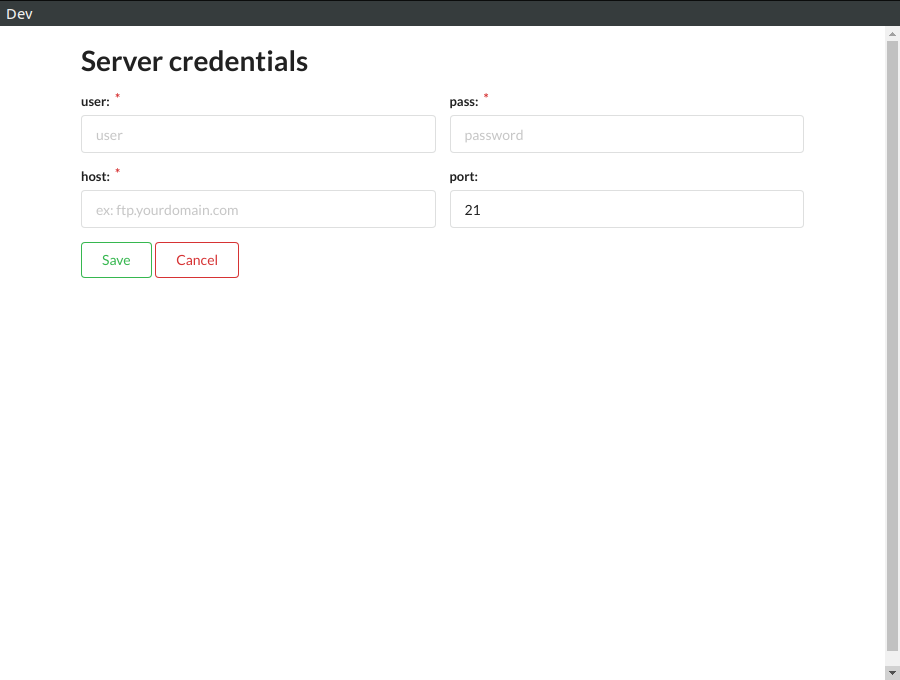
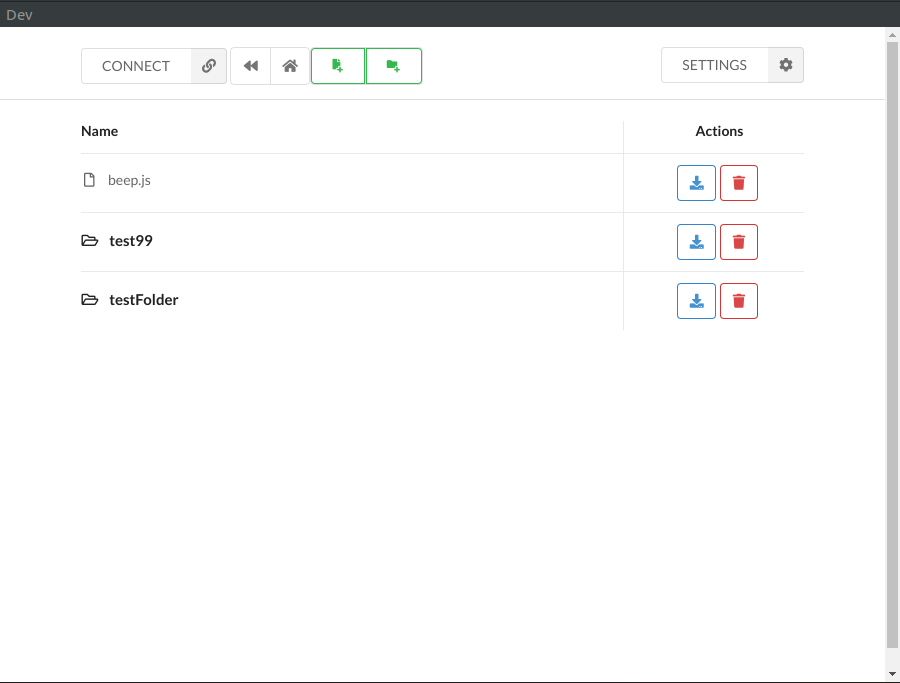
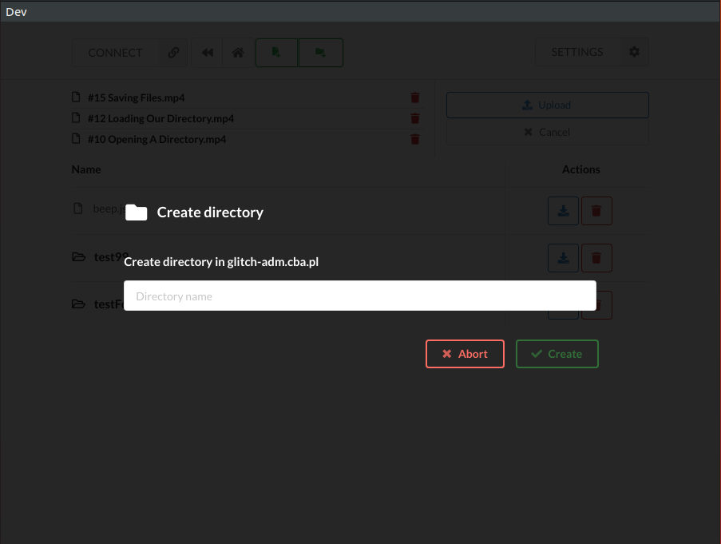
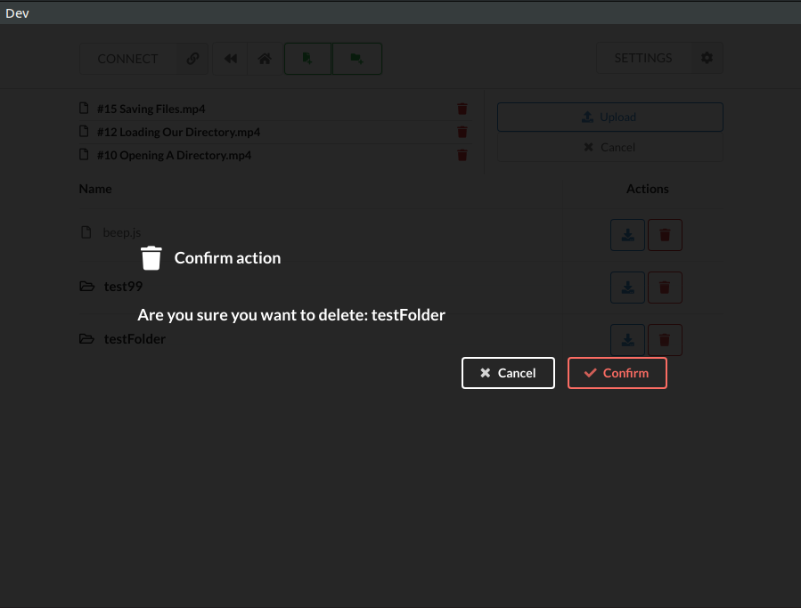
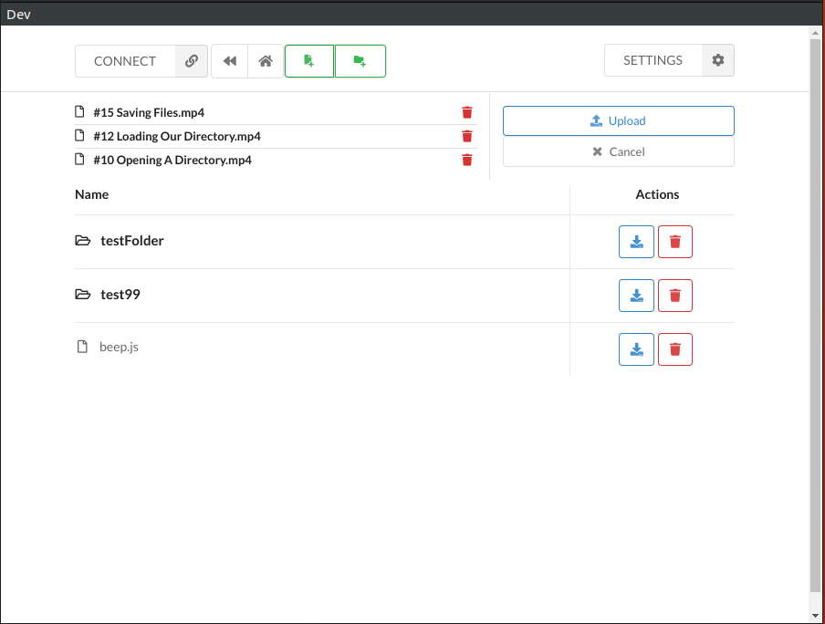

FtpBoss
=========

Current state - unstable. 
I'll need to rebuild main process network handling to use native node.net and remove easy-ftp package. 

Simple program for handling ftp servers. 
* electron
* cra + redux
* semantic + styled-components

#### App remembers provided settings

#### Main window

#### Create directory on server

#### Delete dir or file

#### Upload files or whole directories

 
 ##### TODO
 There are some small things that need to be added: 
 * hashing stored password
 * upload status notifier
 * storing multiple ftp credentials
